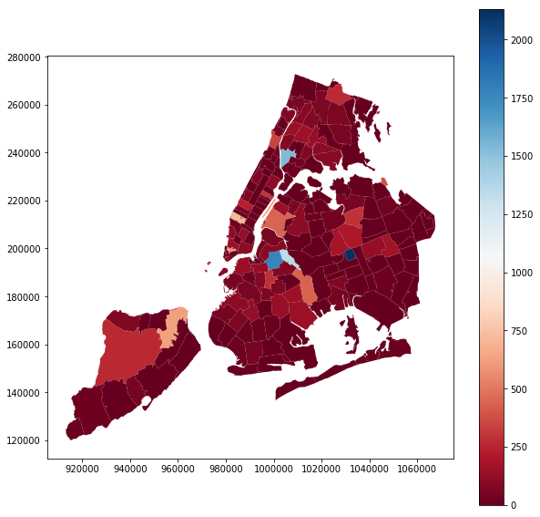

# Assignment 1

Worked with Max, Mark, and Urwa.

#### Part I
Max provided this very useful formula:
np.where(mta_all<threshhold[1])
#### Part II
I did it by myself 
#### Part III
Mark Bauer and Urwa Muaz helped me with the following functions:

np.tile

def getRegCoeff(Y):
    if Y.std() > 0:
        X = sm.add_constant(np.array(range(len(Y))))
        mod = sm.OLS(Y,X).fit()
        return mod.params[0],mod.params[1]
    else : 
        return (np.nan,np.nan)

# Assignment 2

Please refer to my plot revision here as it wasn't pushed to my github:
https://github.com/yunhecui/PUI2018_mv1742/blob/master/HW8_mv1742/mv1742_plotReview_yc3420.md

Improved plot is plotted below:

### Figure 1. presented above shows the estimated reduction in tons of GHG emissions associated (MT) per ZIP CODE
The City’s Long-Term Sustainability Plan, PlaNYC, calls for City government to reduce greenhouse gas emissions produced by municipal operations 30% by 2017. A large part of this effort is retrofitting municipal buildings to become more energy efficient. This dataset lists energy efficiency projects at City buildings that are complete or in progress. Projects are listed by address, building name, and agency, and the dataset includes the estimated reduction in tons of GHG emissions associated with the project.
#### NOTE: ZIPCODE 
A ZIP Code is a postal code used by the United States Postal Service (USPS) in a system it introduced in 1963. The term ZIP is an acronym for Zone Improvement Plan;[1] it was chosen to suggest that the mail travels more efficiently and quickly (zipping along) when senders use the code in the postal address. The basic format consists of five digits. An extended ZIP+4 code was introduced in 1983 which includes the five digits of the ZIP Code, followed by a hyphen and four additional digits that reference a more specific location.

