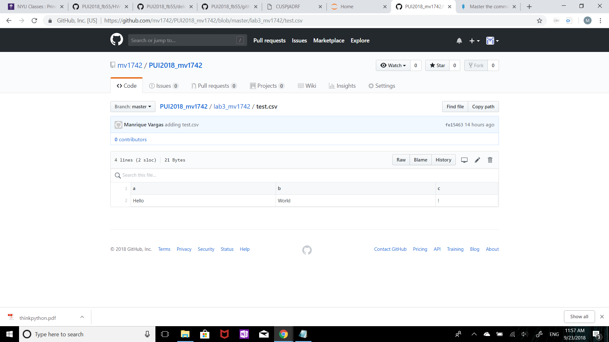
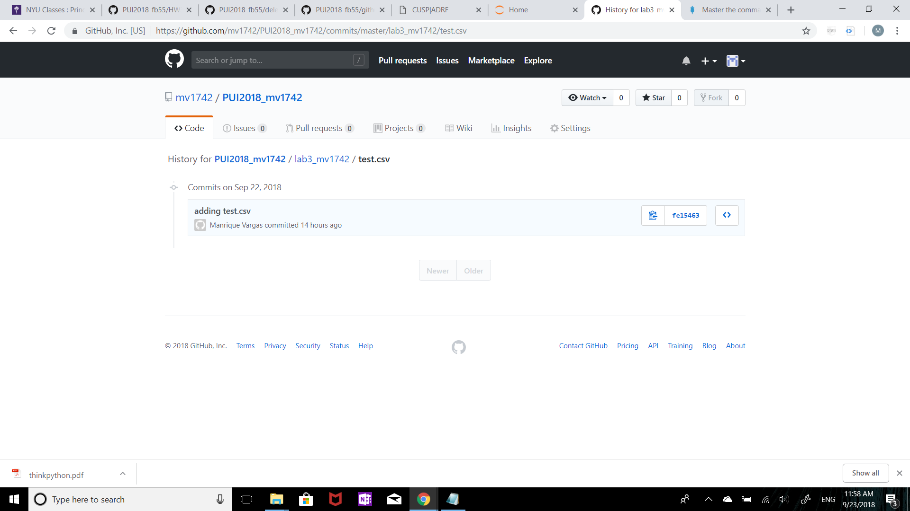

# Description of setting up my enviroment

To set up my environment, I did the steps below:
1. Created a file in this repo inside of the folder lab3_mv1742 called test.csv (capture 1)
2. commited this file to your repo and took a repo screen shot and a screenshot of the folder lab3_mv1742's history (capture 2)
3. typed the commands that allow to remove the file AND ITS HISTORY from the repo.
4. made sure the file was removed from local and took a screenshot of the result (capture 3)

__

# Screenshot

