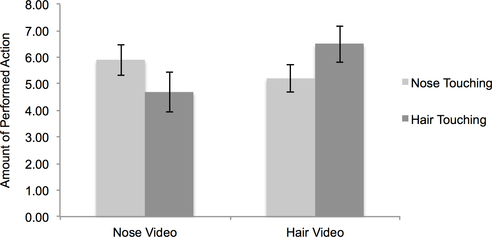
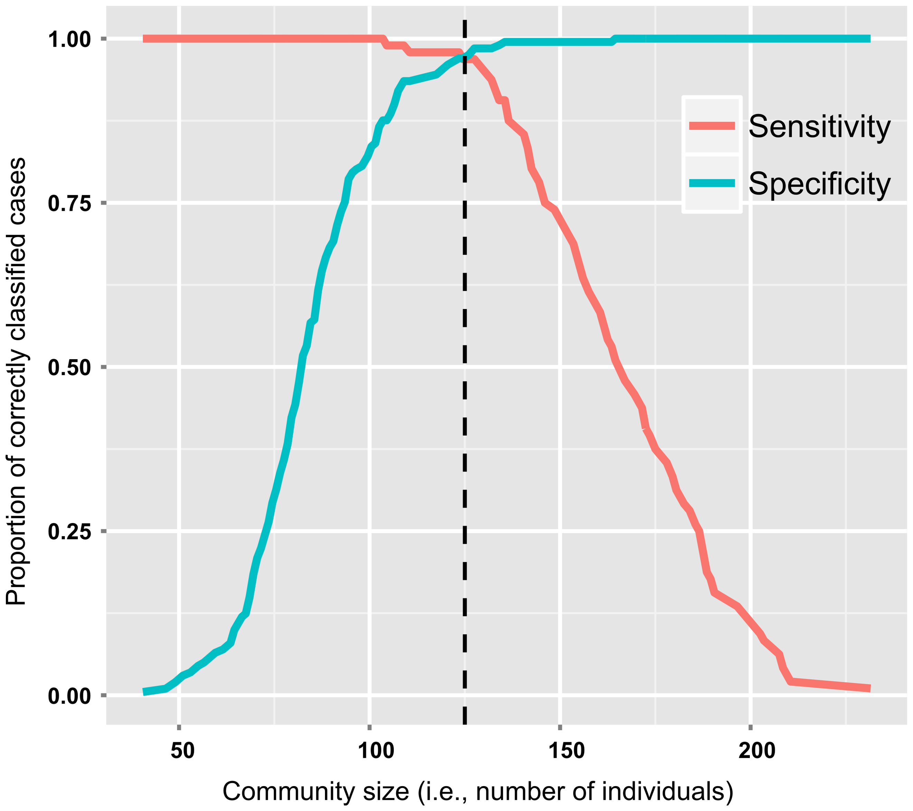

# Assginment 2
 
# Week 6 PUI Homework
## Assignment 2: Literature choices of statistical tests

* I worked with Max Humphreys and Amber YuShi on this assignment.

| **Statistical Analyses**  |  **IV(s)**  |  **IV type(s)** |  **DV(s)**  |  **DV type(s)**  |  **Control Var** | **Control Var type**  | **Question to be answered** | **$H_0$** | **$\alpha$** | **link to paper**| 
|:----------:|:----------|:------------|:-------------|:-------------|:------------|:------------- |:------------------|:----:|:-------:|:-------|
|MANCOVA	| 1,Age | ordinal | 1,FIQ | categorical | sex, diagnosis | continuous (could also be categorical) | 	we test if the effect of autism is dependent on sex within each of these cognitive domains: (i) mentalizing and emotion perception, (ii)executive function, (iii) perceptual attention to detail, and (iv) motor function | Ranks test groups <= Ranks control group | 0.05 | [Cognition in Males and Females with Autism: Similarities and Differences](https://journals.plos.org/plosone/article?id=10.1371/journal.pone.0047198) |
| Correlation| 1, Mimicry Score | continuous | 6, Auto imitation scores| continuous | 1, Order in which tasks were given | discrete | Are mimicry and automatic imitation actually correlated?| $|r_{m,ai}|>0$ | 0.001 | [Mimicry and automatic imitation are not correlated](https://journals.plos.org/plosone/article?id=10.1371/journal.pone.0183784) |
| Logistic regression |# of individuals (community size)| Continuous |Absence or presence of critical scalar stress levels|dichotomous| Hutterties of North America(control group|What is the relationship btw. community size + scalar stress levels in archaelogical communites when size can be estimated? Is there a theshhold of community size that there is a higher propability of a critical scalar stress levels?|test group(s) scalar stress level threshold <= control group scalar stress level threshold| 0.05|https://journals.plos.org/plosone/article?id=10.1371/journal.pone.0091510#s4 |
||||||||

# Other Statistical Test Figures (Ancova, Mancova, Spearman's rank)
 Include the main plot of the paper (the plot that summarized the result)

**Fig 1** Eyes Test and KDEF Test performance

### Correlation figure

**Fig 2** Amountofperformedactionsin themimicrytask.Errorbarsrepresentstandarderrorsof themea.

## Logistic Regresssion Figure

**Fig 4.** Optimal cutoff on Logistic Regression probabilities.

## Description of assignment 2
In this assginment we choose 3 tests of statistical analyses and go to web page of the journal PLOS ONE to search for articles that use those tests.Put the name of my tests in the search and choose a paper that uses the test we selected. Read the relevant portions of the paper and identify what are the Dependent Variables (DV), Independent Variables (IV), and, if applicable, control variables, how many they are, and what type they are (categorical, continuous...).
