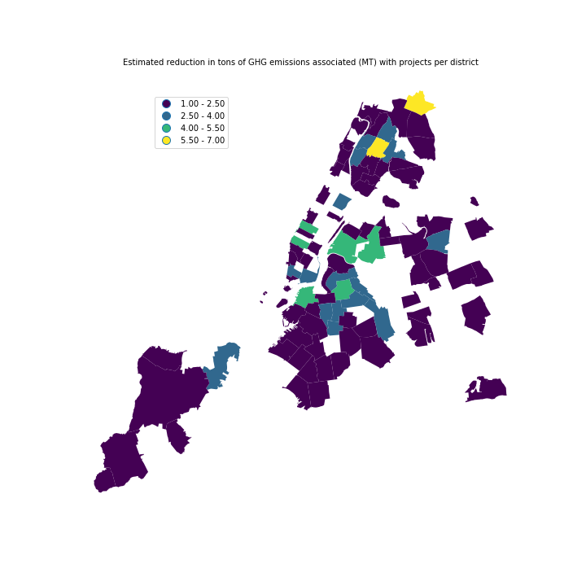

## Assignment 1:

### Figure 1. presented above shows the estimated reduction in tons of GHG emissions associated (MT) per district
The City’s Long-Term Sustainability Plan, PlaNYC, calls for City government to reduce greenhouse gas emissions produced by municipal operations 30% by 2017. A large part of this effort is retrofitting municipal buildings to become more energy efficient. This dataset lists energy efficiency projects at City buildings that are complete or in progress. Projects are listed by address, building name, and agency, and the dataset includes the estimated reduction in tons of GHG emissions associated with the project.

## Assignment 2: 
I worked with Mark Bauer for assignment 2.
Mark drafted the report in Authorea and I ran the Chi square test. We had the same set of data from assignment 4.
### Authorea link: https://www.authorea.com/users/249748/articles/336224-pui-hw8-assignment-2
