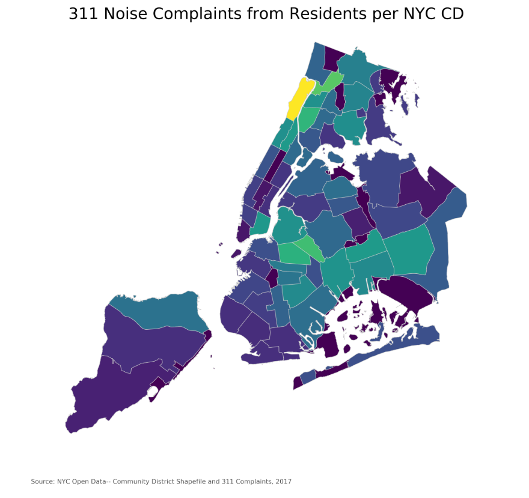

# nl949_plotReview_mv1742
# Nicholas W LiCalzi's Plot for HW8

Dear Nicholas,

## CLARITY

Please add a legend, otherwise it is difficult to get something from your plot.

You made a very interesting observation in your caption that neighbourhoods rapidly gentrifying in that time period have the highest complaint counts.

## ESTHETIC

The font of the comments below in the source should be larger. The font is too small as a proportion of the figure and the main title. Cannot have such a large disproportion. 

Seems like the colours chosen are colour blind friendly. seems like it is viridis which is friendly to the most common types of color blindness. (Here I also recommend an open source tool for color blindness simulator http://colororacle.org) 
Make sure the colour scheme is readible by colour blinded people - see colour blind friendly notes from the professor in Lesson 7: 
https://github.com/fedhere/UInotebooks/blob/master/slides2018/UI7_PUI2018.pdf

## HONESTY

I cannot talk about honesty if there is no information.

Regards,
Manrique
