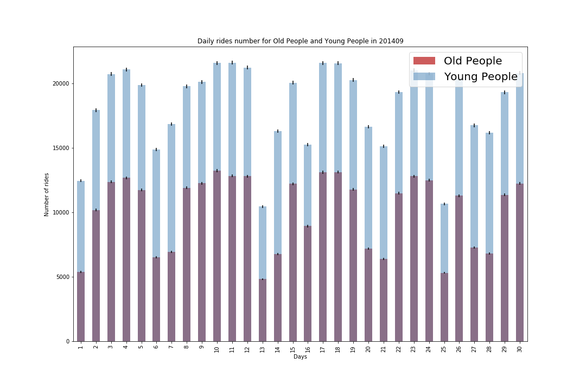

# xc1454_plotReview_mv1742

## CLARITY

The title could have used a clear format for the date. e.g. "September 2014"
It is not clear what the dashes mean (error bars?)
The legend obstructs the data. Make sure to put the legend where the data visualization is not compromised.

## ESTHETIC

The font should be larger. The font is too small as a proportion of the figure. 
The colours are not consistent with the legend.
Make sure the colour scheme is readible by colour blinded people - see colour blind friendly notes from the professor in Lesson 7: 
https://github.com/fedhere/UInotebooks/blob/master/slides2018/UI7_PUI2018.pdf

## HONESTY

The scale of the axis is good.
However it would be better to have the bars for next to each other (not stacked) to compare their magnitude.
