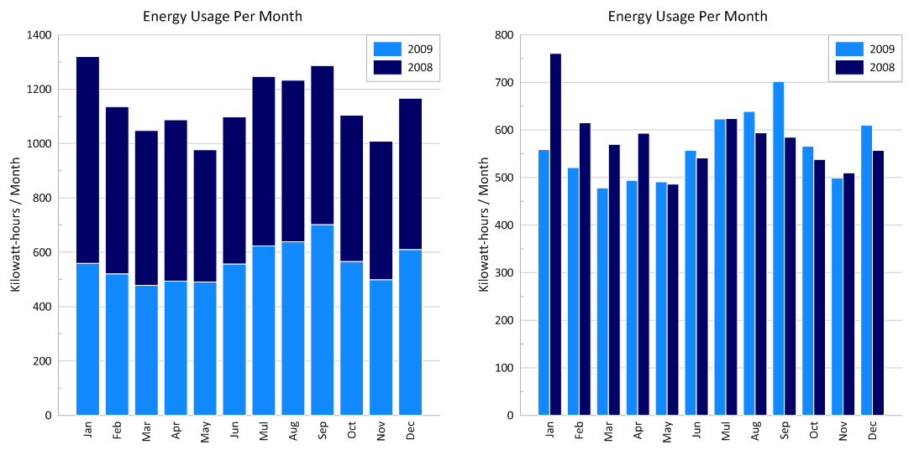

# xc1454_plotReview_mv1742

## CLARITY: is the plot easy to read? is it clear or confusing, are the quantities being visualized ambiguous? 

The title could have used a clear format for the date. e.g. "September 2014"
It is not clear what the dashes mean (error bars?)

## ESTHETIC: beautiful is a subjective judgment: you should not judge the plot on the basis of whether you think it is "beautiful", but you should judge whether its esthetic is functional to what it is meant to communicate. Are the colors chosen appropriately? Are the graphical elements used appropriate to represent the quantities being visualized? Are the graphical choices allowing you to focus on the right elements or are they distracting you?
The font should be larger. The font is too small as a proportion of the figure. 
The colours are not consistent with the legend.
Make sure the colour scheme is readible by colour blinded people - see colour blind friendly notes from the professor in Lesson 7: 
https://github.com/fedhere/UInotebooks/blob/master/slides2018/UI7_PUI2018.pdf

## HONESTY: is the plot honestly reproducing the data or is it deforming it, perhaps to emphasize a point?
The scale of the axis is good.
However it would be good to have the bars for each month next to each other to compare their magnitude.
Something like this:

